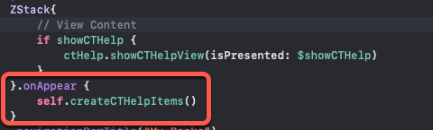

# `CTHelp_SwiftUI`

[](https://developer.apple.com/iphone/index.action)[](https://developer.apple.com/swiftui)

### What is this?


**CTHelp** is a customizable drop in Help solution.  Each one of your screen views can have its own set of 'help cards'.  You can also optionally include a card that links to your web site and one that will initiate an email to to whichever address you specify.

### Requirements
- iOS 13.0+
- SwiftUI
- Xcode 11.0+
### YouTube Video

Watch this video to see installation and use as described below.

The video also provides tips and ideas on how to consolidate all of your help for all of your screens to prevent code redundancy.

https://www.youtube.com/watch?v=YDjF0dXn5Ek

##### Step 1 - Install CTHelp_SwiftUI using Swift Package Manager

1. From within Xcode 11 or later, choose **File > Swift Packages > Add Package Dependency**
2. At the next screen enter https://github.com/StewartLynch/CTHelp_SwiftUI.git when asked to choose a Package repository
3. Choose the latest available version.
4. Add the package to your target.

##### Step 2 - Import CTHelp

For each screen view that you wish to present a set of CTHelp cards, import CTHelp

```Swift
import CTHelp
```

##### Step 3 - Create your instance variables

WIthin your parent screen view's struct, before the body,

1. Create an instance of CTHelp
2. Create a @State variable that will be toggled whenever you want to show or dismiss CTHelp

```swift
let ctHelp = CTHelp()
@State private var showCTHelp = false
```

##### Step 4 - Create an action that will Toggle the showHelp state

Create a button that will toggle the state variable.  This is often placed inside a NavigationBar as a **NavigationBarItem**.  In my example, I am using a system image.

```swift
Button(action: {
  self.showCTHelp = true
}) {
  Image(systemName: "questionmark.circle.fill").font(.title)
}
```

##### Step 5 - Create the Help Cards

Create a function that will create your  CTHelpItems.
Each new card can be created using the `cthelp.new` function that takes one parameter, a `CTHelpItem`

The `CTHelpItem` has 3 `string` parameters; `title`, `helpText` and `imageName`.  All are required, but can also be empty strings.  If the string is empty, the parameter is ignored.

**Note:** The image with the name `imageName` must be available as one of your assets.

A sample function, `createCTHelpItems()`  below creates 5 help cards.

```swift
func createCTHelpItems() {
  // This will clear out any cards in case this function gets called repeatedly for this view
   ctHelp.clearItems()
  // Card 1 is a card with no text and a single image
        ctHelp.new(CTHelpItem(title:"My Books",
        helpText: "",
        imageName:"MyBooksLogo"))
  // Card 2 is a card with no image and text only
        ctHelp.new(CTHelpItem(title:"List of books",
                   helpText: "This screen shows a list of all of the books that you have read.\nAs you read more books you read more books you can add to this list.\nYou can also remove books from the list as well.  See the other help screens here for more information.",
                   imageName:""))
  // card 3 has an image and text
        ctHelp.new(CTHelpItem(title:"Adding a Book",
                   helpText: "To add a book to your collection, tap on the '+' button on the navigation bar.\nEnter the book title and author and tap the 'Add' button",
                   imageName:"AddBook"))
  // card 4 has an image and text
        ctHelp.new(CTHelpItem(title:"Removing a Book",
                   helpText: "To remove a book from your list, swipe from the right to the left and choose 'Remove Book'.",
                    imageName:"RemoveBook"))
  // card 5 has an image and text
        ctHelp.new(CTHelpItem(title: "Book Detail",
                    helpText: "Tap on the 'More' button to view more detail about the book",
                    imageName: "More"))
}
```

**Note:** Images must be created with dimensions that will fit within the help card.  The maximum width and height is 280px X 210px.

The images will **NOT** scale and will exceed the boundaries of the card if they are too large.

The `helpText` field will scroll, but the maximum height for your image should only be used if you have no helpText otherwise the helpText may not be visible.

##### Step 6 - Optional Cards appendDefaults()

There are 2 optional cards that may be included by calling the `appendDefaults` function to your instance of `CTHelp`.  This function takes 5 parameters; `companyName` (String), `emailAddress` (String), `data` (data), `website` (String) and `companyImageName` (String)

###### Email Card

If you assign a non **nil** value to `emailAddress`, a new card will be created and presented, asking the users if he/she wishes to contact the developer. The email address specified will be the address to which the email is sent. 

If, prior to calling the `appendDefaults` function, you gather data for your application and assign it to a Data() object, you can assign that to the `data` parameter. If this parameter not **nil**, the user will also be asked if he/she would like to attach application data to the email.

###### Website Card

If you assign a non **nil** value to `webSite`, a card is displayed with an image using the name specified in `companyImageName` along with some text that asks the user to click on a button that will take the user to the company website defined in the `webSite` address. The image you use must be available as one of your assets.

If you do not wish to include a website card, assign **nil** to each of the three strings.

Here is an example displaying both cards after gathering data.

`ctHelp.appendDefaults` should be added at the end of your card creation function

```swift
// This gathers data from the application and encodes it as a JSON String
let books = StorageFunctions.retrieveBooks()
let encodedBooks = StorageFunctions.encodedBooks(books: books)
let bookData = encodedBooks.data(using: .utf8)
ctHelp.appendDefaults(companyName: "CreaTECH Solutions",
                      emailAddress: "books@createchsol.com",
                      data: bookData,
                      webSite: "https://www.createchsol.com",
                      companyImageName: "CreaTech")
```

##### Step 7 - Embed screen view in ZStack

CTHelp will be displayed as an overlay view on top of your existing screen views.  This is done when the showCTHelp value is set to true.

To enable this, you must embed your current set of screens view (in my case the VStack inside of the NavigationView) inside a **ZStack**

**Hint:**  To do this easily select your content and Command-Click and choose Embed in HStack (or VStack as there is no option to choose ZStack) then change it to a ZStack.


##### Step 9 - Add Conditional CTHelpView

Inside the **ZStack**, after your last bit of content, add the following code.

This will conditionally overlay your help cards only when the `showCTHelp` variable is set to true.

```swift
 // Last item in parent ZStack
if showCTHelp {
  ctHelp.showCTHelpView(isPresented: $showCTHelp)
}
```

##### Step 9 - Add a call to the function when the view appears

Call this function when your ZStack view appears so add this after the closing brace on the ZStack



If you run your project now, you will see that the button action will display the help when tapped. 

##### Step 10 - Final Touches

The ZStack does not cover the navigation bar (or TabBar if you have one) so you need to disable those buttons when your `showCTHelp` variable is **true**. 

This is easy to do as as all you need to do is add `.disabled(showCTHelp)` as a modifier to your button or in my case to the HSTack containing the trailing navigationBar buttons.


### Optional Parameters

As mentioned above there are two additional optional parameters that you can use when creating your instance of `CTHelp`.  

##### Custom Strings

All of the strings used in CTHelp are fully customizable and **all are optional** so you do not need to change every one of them.  To customize the strings, just create a new instance of  a `CTString` and povide a string value for one or more of the optional parameters.  For your reference, the example shown below duplicates the default strings used.

**Note:** in the example below **app name** and **company name** are just placeholders that, when using the default strings, will be replaced by the values provided by your application.  If you are replacing these strings, you must used the real values in your strings.

```swift
let myCTStrings = CTString(contactTitle: "Contact Developer",
                        contactButtonTitle: "Contact Developer",
                        webButtonTitle: "Visit Web Site",
                        dataAlertTitle: "Attach application data",
                        dataAlertMessage: "Would you like to attach your application data to this message to assist the developer in troubleshooting?",
                        dataAlertActionNo: "No",
                        dataAlertActionYes: "Yes",
                        emailSubject: "**app name** Issue",
                        emailBody:  "Please describe the issue you are having in as much detail as possible:",
                        emailAttachNote: "<b>Note:</b>**app Name** data is attached.",
                        contactHelpText: "**company name** would very much like to assist you if you are having issues with **app name**. Please tap button below to initiate an email to the developer.",
                        includeDataText: "  If you agree, your data will be compiled and sent to the developer for analysis.",
                        webHelpText: "**app name** is created by **company name**.  Please visit our website for more information about our company.")
         
```

You can also just declare an instance of CTString and add in only the strings you wish to change like this:

```swift
let myCTStrings = CTString()
myCTStrings.contactTitle = "Bug Report"
myCTStrings.contactHelpText = "Please help us improve this application by submitting your bug reports."
```

Now you can pass this set of strings within your `createCTHelpItems` function

```swift
ctHelp.ctString = myCTStrings
```

##### Custom Colors

CTHelp's default colors are **all optional** and  are compatible with and support dark mode in iOS 13.. This is important to note as you will want to ensure that any custom colors you use have both a light and dark asset available.

To customize the colors, just create a new instance of  a `CTColors` and complete one or more of the optional parameters.  For your reference, the example shown below duplicates the default strings used.

```swift
let myCTColors = CTColors(mailtintColor: .default,
                    bgViewColor: UIColor.systemBackground,
                    helpTextColor: UIColor.label,
                    titleColor: UIColor.label,
                    actionButtonBGColor: UIColor.systemBlue,
                    actionButtonTextColor: UIColor.white,
                    closeButtonBGColor: UIColor.systemGray,
                    pageControlColor: UIColor.secondaryLabel
 )
```

Now you can pass this set of colors within your `createCTHelpItems` function

```swift
ctHelp.ctColors = myCTColors
```

You can also just declare an instance of CTColors and add in only the colors you wish to change like this:

```swift
let myCTColors = CTColors()
myCTolors.titleColor = .red
myCTColors.textColor = .darkGray
```

You if you have declared, and have access an instance of both CTString and CTColors that you created elsewhere in your code, you can pass both of them to your instance of ctHelp when you create it.

```swift
let ctHelp = CTHelp(ctString: myCTStrings, ctColors: myCTColors)
```

### Feedback invited

CTHelp is open source and your feedback for improvements and enhancements is invited.

Please feel free to contact me at slynch@createchsol.com
